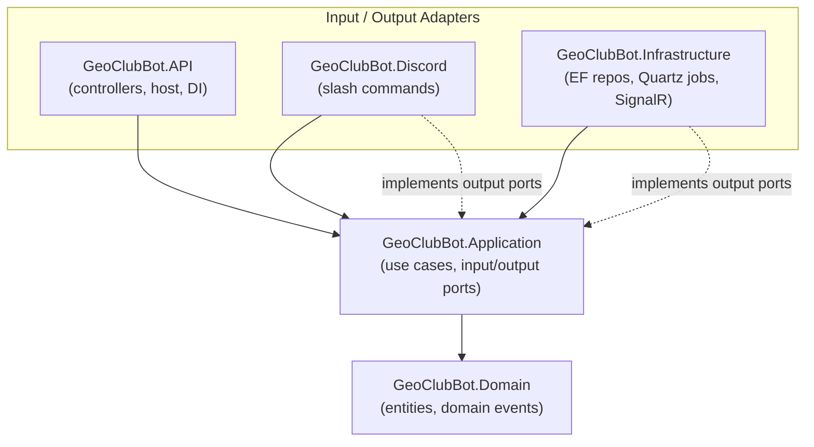

# 🌍 GeoClubBot

A .NET 10 **ASP.NET Core Web API + Discord bot** for running [GeoGuessr](https://www.geoguessr.com/) gaming clubs.
It talks to the GeoGuessr API and Discord to track member activity, manage strikes, run daily
challenges, send mission reminders, and link Discord accounts to GeoGuessr profiles.

<!-- Status -->
[](https://github.com/efibs/GeoClubBot/actions/workflows/ci.yml)
[](https://github.com/efibs/GeoClubBot/actions/workflows/dev-image.yml)
[](https://github.com/efibs/GeoClubBot/actions/workflows/release.yml)
[](https://github.com/efibs/GeoClubBot/actions/workflows/mutation.yml)

<!-- Project -->
[](https://dotnet.microsoft.com/)
[](https://github.com/efibs/GeoClubBot/pkgs/container/geo-club-bot)
[](LICENSE)
[](CONTRIBUTING.md)

---

## Table of contents

- [Features](#features)
- [Architecture](#architecture)
- [Quick start](#quick-start)
- [Configuration](#configuration)
- [Bot commands](#bot-commands)
- [Testing](#testing)
- [Building & publishing](#building--publishing)
- [Documentation](#documentation)
- [Contributing](#contributing)
- [License](#license)

---

## Features

- **🔗 Account linking** — members link their Discord account to their GeoGuessr profile through a
  one-time-password handshake performed *inside* GeoGuessr, so ownership is verified.
- **📊 Activity tracking & strikes** — weekly XP checks against a configurable minimum, with grace
  periods, automatic strikes, and time-based strike decay.
- **🏆 Daily challenges** — scheduled challenges with podium roles for the top three finishers.
- **⏰ Daily mission reminders** — per-user, timezone-aware DM reminders to complete the GeoGuessr
  daily mission.
- **📈 Club & member stats** — today's club XP, personal current-week / rolling-window progress,
  level-up announcements, and MVP rewards.
- **🎭 Self-roles** — members opt into optional roles via a private menu, no admin needed.
- **👥 Member management** — welcome/leave messages, private member channels, multi-club support.
- **🤖 Optional AI features** — Qdrant + Semantic Kernel powered features, gated behind the
  `AI:Active` flag.

Work is driven by a mix of **Discord slash commands** and **Quartz scheduled jobs**
(`SyncClubsJob`, `ActivityCheckJob`, `CheckClubLevelJob`, `DailyChallengeJob`,
`DailyMissionReminderJob`, `DailyMissionLoggingJob`).

## Architecture

GeoClubBot follows **Clean Architecture** with ports-and-adapters. Dependencies point inward;
the inner layers know nothing about Discord, EF Core, or HTTP.



- **Use cases** are MediatR requests + handlers, auto-registered by assembly scan.
- **Repositories** are output-port interfaces in Application, with EF Core implementations in
  Infrastructure.
- **Result type** (`Result<T>` / `Error`) is used for expected failures instead of exceptions, and
  is mapped to HTTP status codes by middleware.

> A full solution map, the namespace↔folder gotcha, and "where do I add X?" recipes live in the
> [Developer Guide](Documentation/DeveloperGuide.md).

## Quick start

### Prerequisites

- [.NET 10 SDK](https://dotnet.microsoft.com/) (pinned in [`global.json`](global.json))
- [Docker](https://www.docker.com/) (for PostgreSQL, and for the integration tests)

### Run locally

```bash
# 1. Start PostgreSQL (compose.yaml also defines qdrant and an Aspire OTel dashboard)
docker compose up postgresqldb

# 2. Run the API + bot
dotnet run --project GeoClubBot.API
```

By default in Development, `GeoGuessr:UseMock=true`, so the app runs against the in-process
**GeoClubBot.MockGeoGuessr** fake API + seeding UI (URL logged at startup) — no real GeoGuessr or
Discord credentials are required to boot.

### Run via Docker

Published images are available on GHCR:

```bash
docker pull ghcr.io/efibs/geo-club-bot:latest
```

## Configuration

Configuration is supplied through `appsettings.json` / environment variables and validated on
startup. Key sections:

| Section | Purpose |
|---|---|
| `ConnectionStrings:PostgreSQL` | PostgreSQL connection string |
| `Discord` | Bot token, server ID, welcome/leave messages & channels |
| `GeoGuessr` | `_ncfa` tokens, sync schedule, per-club settings (`UseMock` for local dev) |
| `ActivityChecker` | Min XP, grace period, max strikes, strike decay window |
| `DailyChallenges` / `DailyMissionReminder` / `DailyMissionLogging` | Cron schedules, channels, podium roles |
| `SelfRoles`, `MemberPrivateChannels`, `ActivityReward`, `GeoGuessrAccountLinking` | Per-feature settings |
| `AI` | Optional AI features (`Active`, model endpoints) |
| `SQL:Migrate` | Auto-apply EF Core migrations on startup |
| `OpenTelemetry:Endpoint` | Opt-in OTLP exporter (e.g. the Aspire dashboard from `compose.yaml`) |

> ⚠️ Keep secrets (Discord bot tokens, GeoGuessr `_ncfa` tokens, API keys) out of source control —
> supply them via untracked local settings or environment variables.

## Bot commands

A full, user-facing rundown of every slash command and user command (with parameters and examples)
lives in the **[Bot Commands Guide](BotCommandsGuide.md)**. Highlights:

| Command | What it does |
|---|---|
| `/gg-account link` | Link your Discord account to your GeoGuessr profile |
| `/daily-reminder set\|stop\|status` | Manage your daily mission reminder |
| `/my-activity current-week\|last-days` | See your own XP / mission progress |
| `/club-stats todays-xp` | See how much XP the club earned today |
| `/user-info gg-nickname\|gg-profile\|discord-user` | Look up GeoGuessr ↔ Discord identities |
| `/self-roles select` | Pick optional roles for yourself |

## Testing

Tests live in **GeoClubBot.Tests** (xUnit + FluentAssertions + NSubstitute) and cover more than the
usual unit/integration split — architecture, snapshot, property-based, and mutation testing too.

```bash
# Fast unit tests (no Docker needed)
dotnet test GeoClubBot.Tests/GeoClubBot.Tests.csproj --filter "Category!=Integration"

# Full suite, including Testcontainers-backed integration tests (needs Docker)
dotnet test GeoClubBot.Tests/GeoClubBot.Tests.csproj
```

The CI pipeline runs the fast unit job and the Docker-backed integration job on every PR — see the
badges at the top of this file for current status.

## Building & publishing

CI/CD is fully automated via GitHub Actions ([`.github/workflows/`](.github/workflows)). The full
test suite (`tests.yml`) is the single source of truth and gates every image publish.

| Branch / trigger | Workflow | Result |
|---|---|---|
| PR into `dev`/`master`, feature-branch push | `ci.yml` | Build + full test suite |
| Push to `dev` | `dev-image.yml` | Tests, then publish `ghcr.io/efibs/geo-club-bot:dev` (+ `:dev-<sha>`) |
| Push a SemVer tag (e.g. `0.13.0`) | `release.yml` | Tests, publish versioned image + `:latest`, create a GitHub Release |
| Weekly / on demand | `mutation.yml` | Stryker mutation score (reports, never fails the build) |

Cut a release by pushing a SemVer tag (no `v` prefix):

```bash
git tag 0.13.0 && git push origin 0.13.0
```

CI authenticates to GHCR with the built-in `GITHUB_TOKEN` — no `CR_PAT` secret needed.

<details>
<summary>Manual Docker build</summary>

```bash
docker build -f ./GeoClubBot.API/Dockerfile -t ghcr.io/efibs/geo-club-bot:your-version .
```

</details>

## Documentation

| Doc | What's inside |
|---|---|
| [CLAUDE.md](CLAUDE.md) | Architecture overview + build/test commands |
| [Developer Guide](Documentation/DeveloperGuide.md) | Solution map and "where do I add X?" recipes |
| [Result Conventions](Documentation/ResultConventions.md) | Error handling with `Result<T>` |
| [Bot Commands Guide](BotCommandsGuide.md) | User-facing command reference |
| [Contributing](CONTRIBUTING.md) | Branching model, pre-commit hook, CI/CD |

## Contributing

Contributions are welcome! Branch off `dev`, open a PR into `dev` (the full suite must pass before
merge), and install the pre-commit hook with `./scripts/install-git-hooks.sh`. See
[CONTRIBUTING.md](CONTRIBUTING.md) for the branching model and details.

## License

Licensed under the [GNU General Public License v3.0](LICENSE).
